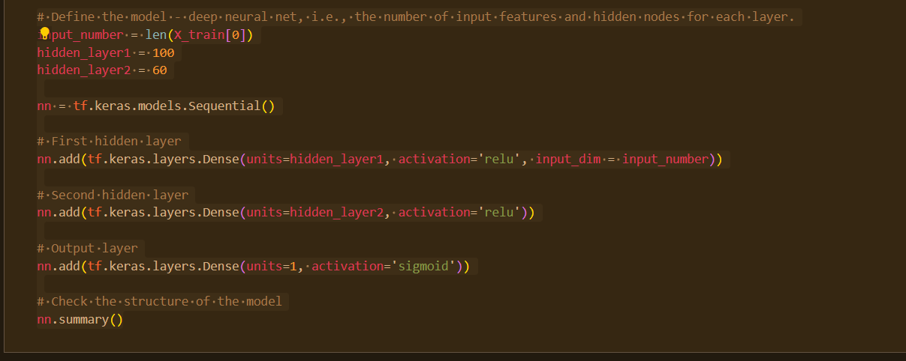
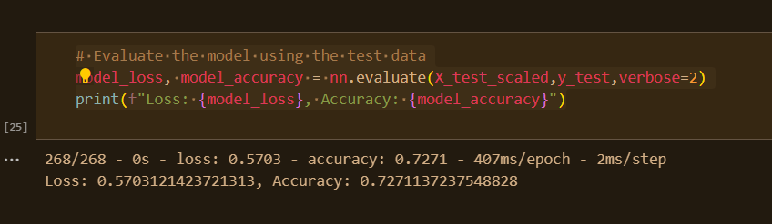

# Neural_Network_Charity_Analysis

## Analysis Overview

The objective of this project was to develop a binary classifier capable of predicting the success of applicants who receive funding from Alphabet Soup. Our analysis was carried out on a dataset consisting of over 34,000 organizations that have been funded by Alphabet Soup throughout the years.

# Results

## Data Preprocessing

- Target variables for the model:
  - IS_SUCCESSFUL

- Feature variables for the model:
  - APPLICATION_TYPE
  - AFFILIATION
  - CLASSIFICATION
  - USE_CASE
  - ORGANIZATION
  - STATUS
  - INCOME_AMT
  - SPECIAL_CONSIDERATIONS
  - ASK_AMT

- Variables that are neither targets nor features and should be removed from the input data:
  - EIN
  - NAME

## Compiling, Training, and Evaluating the Model

- Neural network model configuration:
  - The initial model consisted of two hidden layers. The first layer contained 100 neurons, and the second layer had 60 neurons. Both the first and second layers utilized the 'relu' activation function, while the output layer used the 'sigmoid' activation function. The model was trained for 100 epochs in an attempt to achieve the desired accuracy.
  

- Target model performance achievement:
  - The initial model did not achieve the target accuracy of 75%, reaching only 72.71%.
  

- Efforts to increase model performance:
  1. The first approach involved adding an additional hidden layer to the model with 45 neurons, also using the 'relu' activation function. However, this change resulted in a decrease in accuracy to 72.31%.
  2. The second attempt entailed adjusting the neuron and epoch counts for the model while retaining the additional hidden layer. This modification led to a minimal change in accuracy, bringing it to 72.33%.
  3. The third and final strategy was to introduce a fourth hidden layer and alter the activation function for some of the hidden layers. Unfortunately, this further reduced accuracy to 72.16%.

## Summary

- Overall results of the deep learning model:
  - The deep learning model, despite several attempts to optimize its performance, did not achieve the desired accuracy of 75%. The best accuracy achieved was 72.71%, and subsequent adjustments to the model's architecture only led to a decrease in accuracy.

- Recommendation for a different model:
  - An alternative approach to address this classification problem could be to use a Random Forest classifier. This model is an ensemble learning method that can handle a wide range of data types and often yields robust results without extensive tuning. By training multiple decision trees and averaging their predictions, the Random Forest classifier can potentially provide better classification performance and reduce the risk of overfitting when compared to a single deep learning model.
